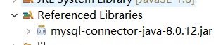

## JDBC工具类使用方法

* 导入JDBC的jar包

  > ​	先复制到lib，再通过build path进行添加到库里面
  >
  > 
  >
  > 
  >
  > 

* 数据库的用户名密码是通过jdbc.properties里面存储的

* 调用工具

  ```
  	
  		try {
  			//1. 注册驱动
  //			DriverManager.registerDriver(new com.mysql.cj.jdbc.Driver());
  //			try {
  //				Class.forName("com.mysql.cj.jdbc.Driver");
  //			} catch (ClassNotFoundException e) {
  //				// TODO Auto-generated catch block
  //				e.printStackTrace();
  //			}
  //			//2. 建立连接 参数1：三个参数。
  //			 conn = DriverManager.getConnection("jdbc:mysql://localhost/students?useSSL=false&serverTimezone=GMT%2B8", "root", "lgj123456");
  //			
  			conn = JDBCUtil.getConn();
  			
  			
  			
  			//3. 创建statement
  			 st = conn.createStatement();
  			
  			//4. 执行查询,得到结果集
  			String sql = "select * from stu";
  			 rs = st.executeQuery(sql);
  			
  			//5. 遍历每一条记录
  			while(rs.next()){
  				int id = rs.getInt("id");
  				String name = rs.getString("name");
  				int age = rs.getInt("age");
  				System.out.println("id="+id + "====name="+name+"====age="+age);
  			}

  			JDBCUtil.release(conn, st, rs);

  ```

* **注意**

  ​

  ```
  			
  			/**
  			在使用preparedstatement 时顺序为如下
  			*/
  			//1. 注册
  			conn = JDBCUtil.getConn();
  			
  			// 2. 使用
  			// 第一步定义sql语句
  			String sql = "select * from stu where name=? and age=?";
  			// 第二步定义preparedstatement
  			PreparedStatement ps = conn.prepareStatement(sql);
  			// 第三部替换！！！
  			ps.setString(1, username);
  			ps.setString(2, password);
  			// 第四步查询！
  			rs = ps.executeQuery();
  			// 还有这里用的是rs.next();
  			if(rs.next()){
  				response.getWriter().write("success login!");
  			}else{
  				response.getWriter().write("failed login!");
  			}
  ```

  ​

  ​