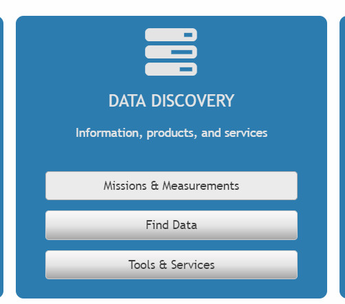
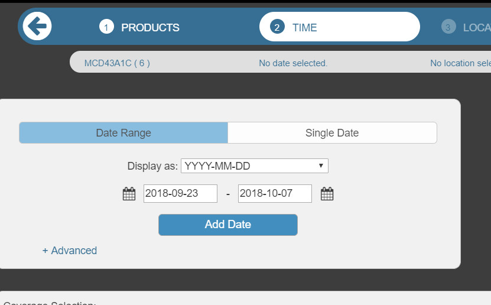
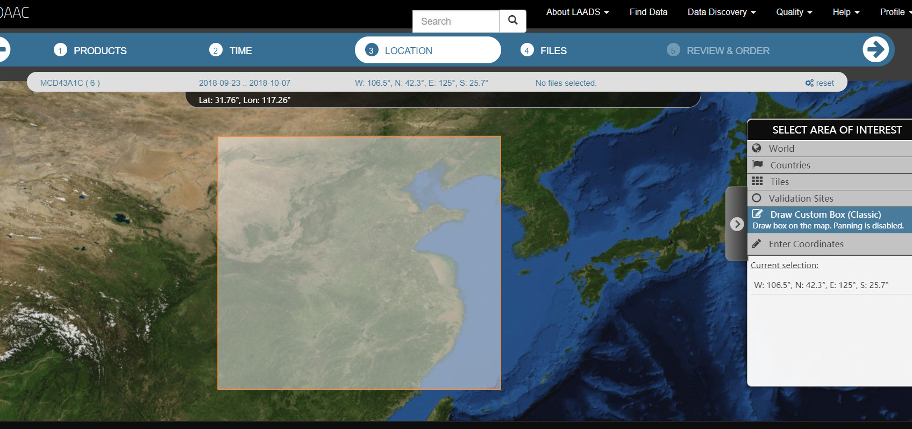
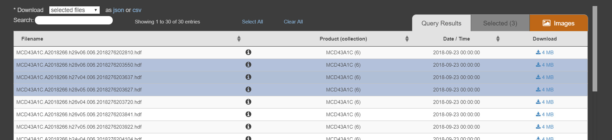
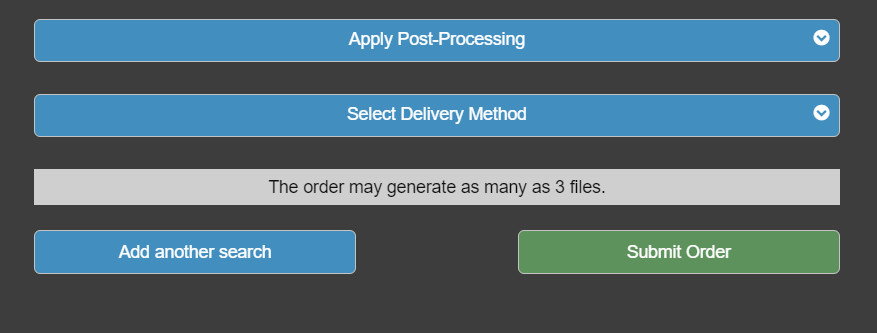
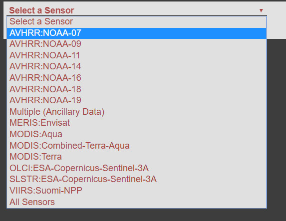
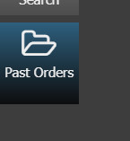
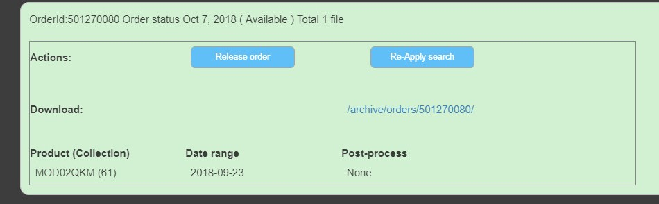
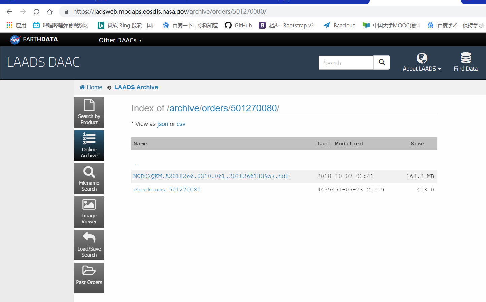
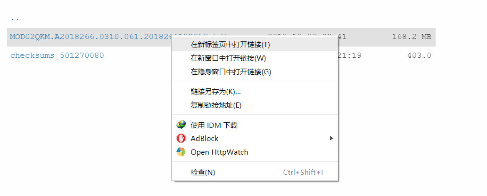

## \Modis数据下载

* 登陆网址   

  >https://ladsweb.modaps.eosdis.nasa.gov/

* 登陆账号

  > username:k765171999
  >
  > password:Kk765171999

* 选择Find Data->选择卫星型号->时间->位置（可以用画的）->选择要下的->submit

  

  

  

  

  

  

* 选择左边的past order

  

* 点击加号

  

* 最后对要下载的数据右键下载

  

