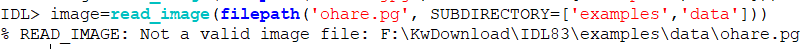
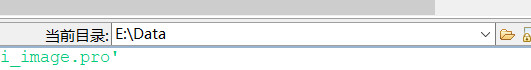
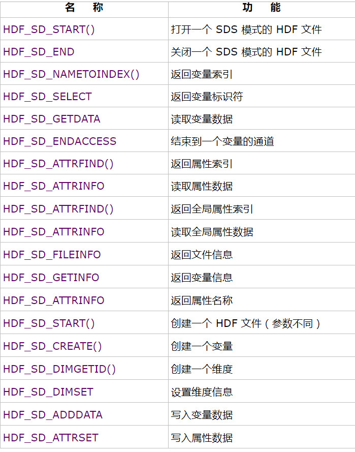

## 遥感图像处理IDL

### 作业一

熟悉ENVI/IDL,练习IDL中数组，>，<,大于（GT），小于（LT）等ENVI波段运算。完成以下题目:

**PS：数据在光盘Data目录下**

* 波段中数据值小于0的赋予-999

```
1.(b1 lt 0)*(-999)+(b1 ge 0)*b1
```

* 三个波段求平均值，要求：如该波段小于0，则不参加运算。

```
2. (b1>0+b2>0+b3>0)/((b1 ge 0)+(b2 ge 0)+(b3 ge 0))
```

* 两幅图像，b1中的云部分（像元大于210）用b2代替。

```
3.(b1 gt 210)*b2+(b1 le 210)*b1
```


###作业二（1）

1. IDL文件读写：修改调试Read_envi_image 程序，完成envi实例数据读取显示。

   ```
   pro Read_envi_image
    	;path=dialog_pickfile(title='pick file')
   	 cd,current=thisdir
   	 ;openr,1,filepath('NOAA.jpg',Root_Dir=thisdir,$
    	;Subdirectory='sl')
   	 image=read_image(filepath('NOAA.jpg',root_dir=thisdir,SUBDIRECTORY=['sl']))
   	 tv,image,true=1
    end
   ```

   >在该代码中'cd,current=thisdir'是得到当前的位置
   >
   >值得注意是该代码主要函数是 read_image    和     filepath

   ```
   //filepath:
   Result = FILEPATH( Filename,[ROOT_DIR=string], [ SUBDIRECTORY=string/string_array],  [/TERMINAL], [ /TMP] )

   //read_image:
   image = READ_IMAGE (FILEPATH('mr_knee.dcm',$
      SUBDIR=['examples', 'data']))
   TV, image,true=1
   ```

#### Filepath

​	在这之中的参数，第一个是文件名字注意用单引号括起来

​	第二个参数是现在的路径，可以不填，不填的话，就是安装目录路径例如：

​	第三个参数是子目录的意思，首先根据自己现在所在的目录，再进一步



#### Read_image

* 最后通过TV,image,true=1进行显示


### 作业二（2）

* NASA账号密码

  > ​	username:k765171999
  >
  > ​	password:Kk765171999

#### IDL读取HDF数据

* 常用HDF SDS程序

  


  

